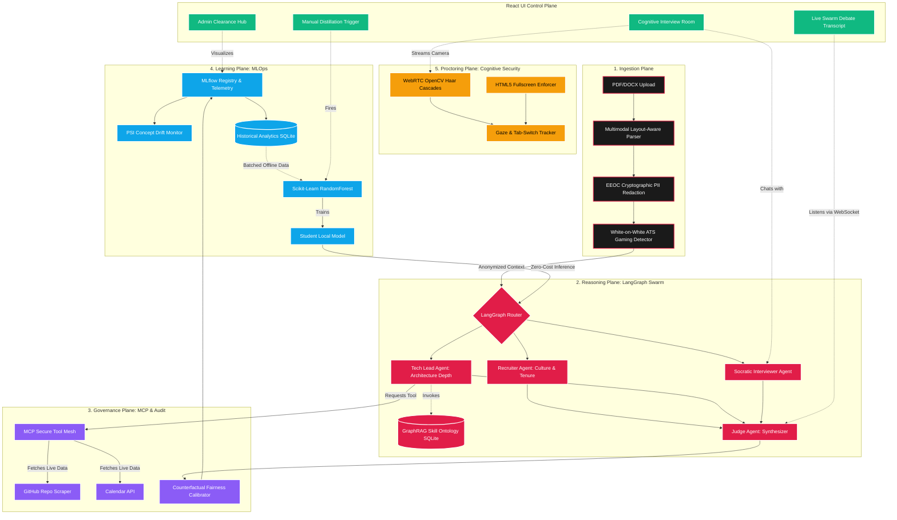

<div align="center">
  <h1>🧠 Enterprise Candidate Intelligence Platform & MLOps Control Plane</h1>
  <p><i>A Staff/Principal-Level Distributed Cognitive Orchestration Engine</i></p>

  [](https://psi-resume-analyser.vercel.app)
  [](https://psi-resume-analyser-api.onrender.com)
  [](https://www.python.org/downloads/)
  [](https://www.langchain.com/langgraph)
  [](https://fastapi.tiangolo.com/)
  [](https://mlflow.org/)
  [](https://www.anthropic.com/news/model-context-protocol)
</div>

---

> This platform is an industrial-grade, multi-agent **Candidate Intelligence Engine**. It transcends simple prompt-chaining by implementing a decoupled, 4-tier operational architecture utilizing **LangGraph agent swarms**, a secure **MCP Tool Mesh**, an offline **Teacher-Student distillation pipeline**, and strict **MLflow Observability governance**.

## 📚 Technical Documentation Hub

For deep dives into specific architectural components, explore our detailed documentation modules:

*   🤖 **[Advanced AI, ML, & GenAI Architectures](docs/AI_ML_GENAI.md)**: Deep dive into the Agent Swarm, Counterfactual Fairness, and Teacher-Student Distillation.
*   📊 **[MLOps & Governance](docs/MLOPS.md)**: Explains the MLflow telemetry, Cost Budgets, and PSI Drift Monitoring.
*   🏗️ **[High Level Design (HLD)](docs/HLD.md)**: Network diagrams, server infrastructure, and deployment architecture.
*   🔬 **[Low Level Design (LLD)](docs/LLD.md)**: Internal LangGraph state transitions, TypedDict schemas, and codebase routing.
*   💻 **[CLI Automation & Scripts](docs/CLI.md)**: Details on the offline batch scanner, health checks, and terminal metrics.
*   🚀 **[HuggingFace / Gradio Fallback](docs/HUGGINGFACE.md)**: Documentation on the zero-config Gradio UI fallback.

---

## 🗺️ Master Architecture Diagram

The platform operates across four decoupled planes: Ingestion, Reasoning, Governance, and Learning.



---

## 🧬 Industrial AI & ML Techniques Implemented

### 1. LangGraph Multi-Agent Swarms
Traditional LLM wrappers use static chains. This platform implements a **dynamic, cyclical Swarm** using LangGraph. The cognitive load is separated:
*   **Recruiter Agent**: Argues for candidate viability based on tenure and soft metrics.
*   **Tech Lead Agent**: Counter-argues strictly on architectural depth.
*   **Judge Agent**: Ingests the adversarial debate to form an unbiased consensus.

### 2. Teacher-Student Model Distillation (Offline Learning)
Running massive LLMs (the "Teacher") for every candidate is economically unviable at scale. 
We built an offline pipeline that extracts historically scored resumes from the SQLite telemetry database, vectorizes them using `TfidfVectorizer`, and trains a lightweight Scikit-Learn `RandomForestRegressor` (the "Student"). The Student model then performs zero-cost, local inference on future candidates.

### 3. Model Context Protocol (MCP) Tool Mesh
Rather than giving the LLM unrestricted internet access, we implement an **Anthropic MCP Tool Mesh**. Tools like GitHub Repo Scraping and Calendar scheduling are strictly tiered. For instance, only the `Tech Lead Agent` has the cryptographic clearance to invoke the GitHub scraper during its debate turn.

### 4. GraphRAG Skill Ontology
Vector embeddings struggle with hierarchical knowledge. We implemented a property graph in SQLite. Instead of flat keyword matching, the system calculates "trajectory fit" across an adjacency matrix (e.g., knowing that knowing `PyTorch` intrinsically maps to `Python` and `Deep Learning`).

### 5. Counterfactual Prompting & Bias Calibration
To eliminate bias, the system runs counterfactual "What-If" scenarios during scoring. By synthetically injecting/masking variables (gender, graduation year, buzzwords), the system audits its own outputs to ensure strict EEOC meritocratic compliance.

### 6. MLOps Observability & PSI Drift Monitoring
Integrated directly with **MLflow**, the platform logs parameters (Temperature, Provider), execution metrics (Latency, Token Usage), and artifacts (State Dictionaries) for every scan. A background chron-job calculates the **Population Stability Index (PSI)** to warn administrators if the LLM's scoring curve diverges from the historical baseline (Data Drift).

### 7. Cognitive Socratic Interviewer & Industrial Proctoring
The platform includes a real-time, interactive interview room driven by a stateful LangGraph orchestrator. It uses an adaptive difficulty algorithm to challenge candidates dynamically. This environment is hardened by an industrial-grade proctoring suite:
*   **OpenCV Haar Cascades**: Lightweight WebRTC computer vision tracks multi-face detection and gaze deviations (Eyes Not On Screen) without incurring heavy memory loads (bypassing heavy deep learning models).
*   **HTML5 Full Screen Enforcer**: Strict enforcement of browser full-screen APIs and `visibilitychange` events instantly red-flags split-screen usage or tab switching.

---

## ⚙️ Local Development Quickstart

### 🐳 Docker Compose (Multi-Container Stack)
Spin up the FastAPI server, React web interface, and local MongoDB database in one command:
```bash
# Deploys containers in background
docker-compose up -d

# Watch backend logs
docker-compose logs -f app
```

### 🛠️ Manual Installation (Virtual Environment)

1.  **Backend Gateway Setup**:
    ```bash
    # Create and activate virtual environment
    python -m venv .venv
    source .venv/bin/activate  # On Windows: .venv\Scripts\activate

    # Install dependencies
    pip install -r requirements.txt

    # Start backend API
    uvicorn api:app --reload --port 7860
    ```

2.  **Frontend Client Setup**:
    ```bash
    cd frontend
    npm install
    npm run dev
    ```

3.  **Administrator VIP Bypass Protocol**:
    Set the `ADMIN_MAIL` environment variable. On the VIP checkout page, click **LOGIN AS ADMIN & BYPASS** and enter your administrator email to instantly unlock the premium Enterprise Control Plane.

---

## 🚀 Future Research & Architectural Roadmap (2025-2026)

To elevate this platform to the standard of **Google Research, Microsoft Research, OpenAI, and Anthropic**, we are implementing a bleeding-edge roadmap targeting **Test-Time Scaling** and **Agentic OS Architecture**:

1. **Test-Time Scaling & Tree of Thoughts (o3/R1 Style)**: Implementing an internal reasoning loop where the agent generates 5 reasoning paths, performs self-consistency verification, and uses a Critic Agent before finalizing evaluations.
2. **Large Vision Language Models (LVLM)**: Migrating from OpenCV/YOLO to unified LVLMs (e.g., Qwen2.5-VL, Llama 4 Vision) that reason over webcam, whiteboard, IDE, and gestures simultaneously.
3. **Agentic Interview Operating System**: Transitioning from a single Interview Agent to a decentralized OS comprising Planning, Memory, Reflection, Critic, Judge, and Safety Agents.
4. **Constitutional AI & Counterfactual Bias Guardrails**: Establishing an AI Constitution to guarantee EEOC and GDPR compliance, ensuring zero-hallucination and rigorous bias mitigation.
5. **Continuous Online Learning & Knowledge Distillation (RAD)**: Establishing an automated pipeline where Teacher Ensembles (GPT-4/Claude 3.5) generate synthetic labels to continuously fine-tune our lightweight student model, **PSI-ProctorNet**.
6. **Multi-Agent Reinforcement Learning (RLHF)**: Implementing a reward model where each agent (Planner, Critic, Judge) learns from human recruiter feedback over time.
7. **Federated Learning & Temporal Knowledge Graphs**: Enabling enterprise clients to train the scoring model locally on their encrypted data, utilizing PyTorch Geometric and DGL for skill graph propagation across time.

---
*Architected and engineered as a comprehensive Staff/Principal AI Engineering portfolio standard.*
