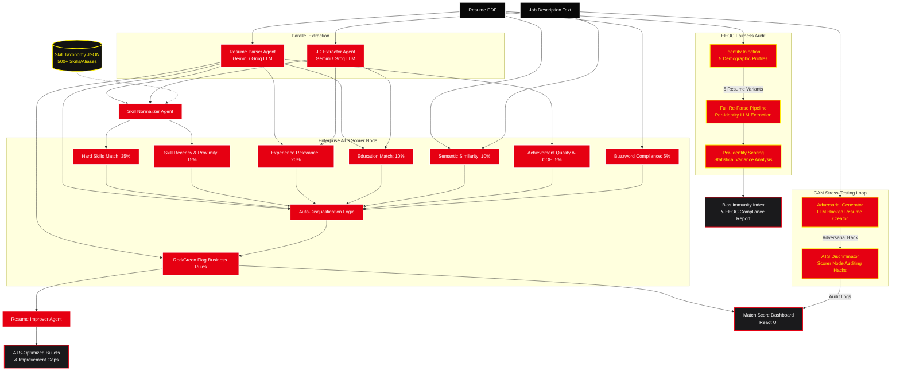

# 🎭 PSI Resume Analyser — Persona 5 Royal Edition 👑

[](https://github.com/naman-fr/PSI_resume_analyser/actions)
[](https://github.com/naman-fr/PSI_resume_analyser/actions)
[](https://opensource.org/licenses/MIT)
[](https://huggingface.co/spaces/namangt/PSI_resume_analyser)

An industrial-grade, multi-agent **ATS (Applicant Tracking System) Matcher, Enhancer, and Compliance Auditor** built using **LangGraph**, **React**, and **FastAPI**. Fully overhauled with a high-fidelity **Persona 5 Royal** styling theme (stark diagonals, neon glitch text, asymmetric grids, scan lines, and high-impact manga-style animations).

---

```
  _________  ________  ___          _______   ________  ________  ________  _____  ___      ________ 
 / ___/ __ \/ ___/ _ \/ _ \        / ___/ _ \/ __/ __ \/  _/ __ \/  _/ __ \/  _/ |/ / |    / ___/ _ \
/ /__/ /_/ (__  ) , _/ //_/       / /__/ , _/ _// /_/ // // /_/ // // //_/ // //    /| |   / /__/ , _/
\___/\____/____/_/|_|____/        \___/_/|_/___/\____/___/\____/___/\____/___/_/|_/ |_|   \___/_/|_/ 
                                  [ THE COGNITIVE ATS SYSTEM ]
```

---

## 🗺️ System Architecture

The application runs a directed acyclic graph (DAG) orchestrated via **LangGraph**. The workflow enforces strict validation boundaries, standardizes raw candidate details, and processes demographic counterfactuals to run bias compliance checks.



---

## ⚡ Core Features

### 🏆 1. ATS Match Scoring (7-Factor Model)
Candidate fit is calculated using a comprehensive weighted matching formula:
1. **Hard Skills Match (35%)**: Overlap percentage of candidate's normalized skills against job requirements.
2. **Skill Recency & Proximity (15%)**: Weighting based on how recently a skill was utilized in professional experience.
3. **Experience Relevance (20%)**: Mathematical fit of experience history and title hierarchy.
4. **Education Match (10%)**: Degree level evaluation vs. requirement profiles.
5. **Semantic Similarity (10%)**: Dense embedding cosine similarity computed locally via `all-MiniLM-L6-v2`.
6. **Achievement Quality (5%)**: Bullet point analysis evaluating Action, Context, Outcome, and quantitative Evidence (A-COE).
7. **Buzzword Compliance (5%)**: Penalty indexing of generic corporate jargon density.

### 🚨 2. Compliance & Flag Engine
* **Red Flags**: AI-generated pattern scoring, timeline gaps exceeding 12 months, job-hopping tenures, fabrication risk (skills not backed by experience bullets).
* **Green Flags**: Progressive growth title trajectories, portfolio/GitHub accessibility verification, rehire indices, A-COE bullet layouts.

### 🛡️ 3. Adversarial GAN Stress-Tester & EEOC Auditor
* **GAN Loop**: Pit a generative hacker LLM against the scoring engine to test prompt injections, verifying that security guardrails catch and neutralize adversarial prompts.
* **EEOC Fairness**: Counterfactual identity testing. Auto-injects 5 distinct demographic profile name variants into the candidate resume and runs the full pipeline. Verifies standard deviation ($\sigma$) is $< 2.0$ to pass unbiased fairness criteria.

### ⭐ 4. Premium Tier Sandbox Integration
Simulated secure Stripe checkout modal unlocks advanced verification layers:
* **Invisible White-Text Scan**: Metadata parsing checking for white-colored hidden keywords stuffed in template backgrounds.
* **Integrity url verification**: Live ping tests for candidate portfolios, alongside public metadata scraping to generate a **Candidate Trustability Index (0-100)**.

---

## 📦 Production Architecture & Split Deployment

To scale efficiently, the project is configured for **Split Deployment** (Vercel Frontend + Render Backend) connected via a secure, matrixed CI/CD pipeline:

```
  [ React + Vite SPA ] ──► ( Vercel Edge Server )
         │
    (API Requests via VITE_API_URL)
         │
         ▼
  [ FastAPI Backend ] ──► ( Render Web Services )
```

### 1. Frontend Configuration (Vercel SPA)
* **Root Directory**: `/frontend`
* **Vercel Config**: `frontend/vercel.json` maps incoming `/api/*` requests directly to Render and resolves SPA routing fallbacks.
* **Environment Variable**: `VITE_API_URL` set to the live Render deployment URL.

### 2. Backend Configuration (Render Blueprint)
* **Start Command**: `uvicorn api:app --host 0.0.0.0 --port $PORT`
* **Blueprint**: `render.yaml` automatically provisions the Python runtime environment, installs dependencies, and hooks environment secrets.
* **CORS Settings**: Restricts accepted cross-origin targets to designated Vercel subdomains via environment variable settings.

---

## 🚀 Local Development Setup

### 1. Backend Service
```bash
# Clone the repository
git clone https://github.com/naman-fr/PSI_resume_analyser.git
cd PSI_resume_analyser

# Create and activate python environment
python -m venv .venv
source .venv/bin/activate  # On Windows: .venv\Scripts\activate

# Install dependencies
pip install -r requirements.txt

# Create .env config
echo "GROQ_API_KEY=your_key_here" >> .env
echo "GOOGLE_API_KEY=your_key_here" >> .env

# Run FastAPI server
uvicorn api:app --host 127.0.0.1 --port 7860
```

### 2. Frontend client
```bash
cd frontend
npm install
npm run dev
```
Open `http://localhost:5173` in your browser.

### 3. Run Tests
```bash
python -m pytest
```

---

## 🔄 CI/CD Pipelines
Located under `.github/workflows/`:
* **`ci.yml`**: Automatically triggers on pushes or pull requests to `main` and `webapp` branches. Sets up Python + Node matrix environments, executes the 103+ unit test suite, and compiles the React build bundle.
* **`deploy.yml`**: Triggered automatically on push to `main` and `webapp` branches. Deploys the frontend build target to Vercel and triggers the Render API deploy endpoint to deploy the updated backend service.

---

## 🛠️ Industrial Refinements

1. **CORS Wildcard Regex Parser**: Rewrote origin sanitisation in [api.py](file:///c:/Users/naman/Downloads/PSI_resume_analyser/api.py) to compile wildcard domains (like `https://psi-resume-analyser-*.vercel.app`) into regular expressions passed to Starlette's `allow_origin_regex`. This resolved the silent `ValueError` crash on startup.
2. **Real-time Logging Observability**: Integrated `PYTHONUNBUFFERED=1` in [render.yaml](file:///c:/Users/naman/Downloads/PSI_resume_analyser/render.yaml) environment parameters to disable Python output buffering.
3. **Explicit Server Dependencies**: Added explicit dependencies to [requirements.txt](file:///c:/Users/naman/Downloads/PSI_resume_analyser/requirements.txt) including `fastapi`, `uvicorn`, `python-multipart`, `pytest`, and `httpx`.
4. **Scrollable Product Landing Directory**: Redesigned the Home tab in the frontend React app to be a scrollable landing portal explaining all 6 AI chambers (math/models, security parameters, STAR bullet optimization), integrated with active navigation controls.
5. **Universal Scrollability**: Restructured [index.css](file:///c:/Users/naman/Downloads/PSI_resume_analyser/frontend/src/index.css) layout constraints to force vertical scrolling on all tabs.


