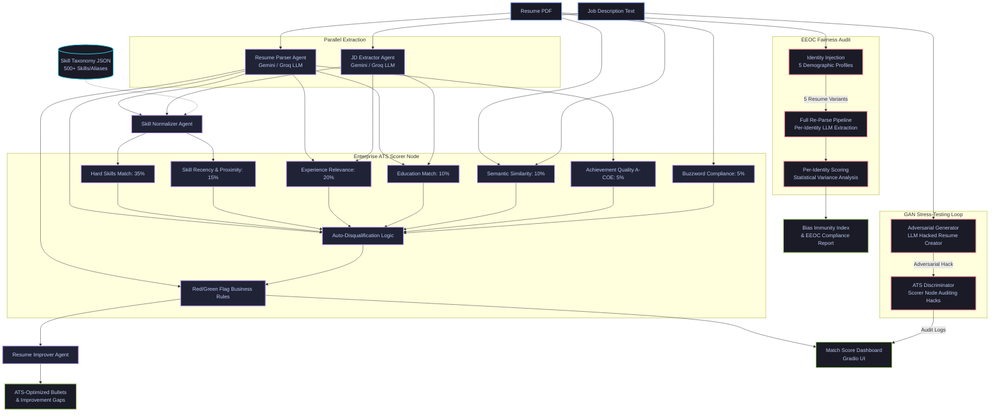

# PSI Resume Analyser 📄

An industrial-grade multi-agent **ATS (Applicant Tracking System)** scoring and optimization pipeline built with **LangGraph**, **Gradio**, and **Google Gemini / Groq**.

> Enterprise-grade resume screening with 7-factor weighted scoring, adversarial stress-testing, and EEOC-compliant demographic fairness auditing.

---

## 🗺️ System Architecture

### 📊 Visual Workflow


### 🔄 Data Flow Detail (LangGraph Structure)



---

## ⚡ Key Features

### 🎯 Enterprise ATS Scoring (7-Factor Model)
- **Hard Skills Match** (35%) — Exact keyword overlap using normalized skill taxonomy
- **Skill Recency** (15%) — Penalizes stale skills not used in recent roles/projects
- **Experience Relevance** (20%) — Role-level years comparison with surplus scaling
- **Education Match** (10%) — Degree hierarchy comparison (High School → PhD)
- **Semantic Similarity** (10%) — Dense embedding cosine similarity (MiniLM-L6-v2)
- **Achievement Quality** (5%) — A-COE (Action-Context-Outcome-Evidence) bullet analysis
- **Buzzword Compliance** (5%) — Penalizes generic corporate buzzwords without substance

### 🚨 Business Rule Engine
| Rule | Penalty | Trigger |
|------|---------|---------|
| AI-Resume Detection | **AUTO-DISQUALIFY** | Template probability ≥ 85% |
| Timeline Gaps | **-15.0 pts** | Unexplained gaps > 12 months |
| Job Hopping | **-10.0 pts** | 3+ tenures < 12 months |
| Fabrication Risk | **-8.0 pts** | < 50% skills backed by experience |
| Buzzword Overload | **-5.0 pts** | Excessive corporate buzzwords |
| Vague Achievements | **-5.0 pts** | Achievement quality < 40% |

### 🟢 Green Flag Bonuses
| Flag | Bonus | Trigger |
|------|-------|---------|
| COE Formatted Bullets | **+5.0 pts** | Achievement quality ≥ 70% |
| Skill-JD Mirroring | **+4.0 pts** | Validation ratio ≥ 80% |
| Upward Trajectory | **+3.0 pts** | Chronological seniority growth |
| Alignment Hero Section | **+3.0 pts** | Summary matches target role |
| Portfolio Accessible | **+2.0 pts** | Active portfolio/GitHub links |
| Rehired by Same Employer | **+2.0 pts** | Repeated tenures at same company |

### 🛡️ GAN Adversarial Stress-Tester
Simulates a **Generative Adversarial Network** framework:
1. **Generator** — LLM crafts a keyword-stuffed, AI-styled resume targeting the JD
2. **Discriminator** — The ATS Scorer intercepts and flags structural issues, buzzwords, AI patterns, and timeline manipulation
3. **Result** — Side-by-side comparison showing how the system defeats adversarial hacking attempts

### ⚖️ EEOC Demographic Fairness Audit (Genuine Counterfactual Testing)
**Not hardcoded** — runs a real statistical analysis:
1. **Identity Injection** — Injects 5 demographic profiles (names, pronouns, honorifics) into the raw resume text
2. **Full Re-Parse** — Each variant is re-parsed through the LLM, detecting if the parser extracts different data for different identities
3. **Per-Variant Scoring** — Each parsed variant runs through the full scorer pipeline
4. **Statistical Variance** — Reports range, standard deviation, and per-factor variance
5. **EEOC Compliance** — Requires < 3pt deviation per profile and < 2.0 stdev across all profiles

---

## ⚡ Performance Optimizations

- **Combined LLM Normalization** — Single concurrent LLM call for both resume + JD skill normalization (50% API savings)
- **Concurrent Startup Loader** — Pre-loads SentenceTransformer in background thread at app launch
- **Deterministic Experience Matcher** — Local rule-based scoring in microseconds (no LLM roundtrip)
- **Robust Exception Handling** — Safeguards all lookups against null values from parsed inputs

---

## 🛠️ Tech Stack

| Component | Technology |
|-----------|------------|
| **Orchestration** | LangGraph + LangChain |
| **Primary LLM** | Google Gemini 2.0 Flash |
| **Fallback LLM** | Groq (Llama 3.3 70B) |
| **Embeddings** | all-MiniLM-L6-v2 |
| **PDF Parsing** | PyPDF2 + pdfplumber |
| **Skill Taxonomy** | Custom JSON taxonomy with 500+ aliases |
| **Frontend UI** | Gradio 5.33.0 with premium custom CSS |
| **Deployment** | HuggingFace Spaces |

---

## 🚀 Quick Start

### 1. Installation
```bash
# Clone the repository
git clone https://huggingface.co/spaces/namangt/PSI_resume_analyser
cd PSI_resume_analyser

# Install dependencies
pip install -r requirements.txt
```

### 2. Configure Environment
Create a `.env` file in the root directory:
```env
GROQ_API_KEY=your_groq_api_key_here
GOOGLE_API_KEY=your_gemini_api_key_here
```

### 3. Run Locally
```bash
python app.py
```

---

## 📊 Scoring Formula

$$\text{Base Score} = 0.35 \times \text{Hard Skills} + 0.15 \times \text{Skill Recency} + 0.20 \times \text{Experience Relevance} + 0.10 \times \text{Education Match} + 0.10 \times \text{Semantic Similarity} + 0.05 \times \text{Achievement Quality} + 0.05 \times \text{Buzzword Compliance}$$

$$\text{Final Match Score} = \min\left(100.0, \max\left(0.0, \text{Base Score} + \sum \text{Green Flag Bonuses} - \sum \text{Red Flag Penalties}\right)\right)$$

---

## 📄 License
MIT License
