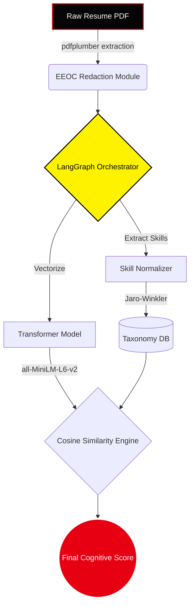

<div align="center">

# 🎭 PSI Resume Analyser: Cognitive ATS Masterclass

<a href="https://psi-resume-analyser.onrender.com">
  
</a>
<a href="https://render.com">
  
</a>
<a href="https://react.dev">
  
</a>
<a href="https://fastapi.tiangolo.com/">
  
</a>

<br/>

*Infiltrate the ATS algorithm. Expose hidden alignments. Secure the job.*

<p align="center">
  
</p>

</div>

---

## ⚡ Overview

The **PSI Resume Analyser** is an enterprise-grade, Multi-Agent pipeline built to ruthlessly audit resumes against target Job Descriptions. Using advanced **Semantic Cosine Similarity** and **LangGraph Orchestration**, it strips away the bias of traditional recruiter tools and evaluates your background based on pure, unadulterated technical merit.

Featuring a completely bespoke, heavily animated **Persona 5 Masterclass UI**, the application is designed to be as visually mesmerizing as its backend is powerful. The platform has recently been upgraded with a **Premium Intelligence Suite** capable of bypassing hidden filters and simulating live recruiter interviews.

---

## 💎 The Premium Intelligence Suite (VIP)

The core architecture has been extended with a secure, authenticated Vault system. Upgrading to VIP Clearance unlocks the Ultimate Intelligence Suite:

> [!IMPORTANT]
> **VIP Authentication Node**: Features secure, bcrypt-hashed JWT login terminals. The VIP tier is protected by a Mock Stripe/Razorpay payment gateway integration, securely modifying your MongoDB clearance cluster upon successful verification.

- 🕵️ **ATS Integrity Node**: Scans your PDF for invisible white-text keyword stuffing and formatting anomalies. Outputs an Authenticity Score to ensure your resume doesn't trigger ATS auto-rejections.
- 🔗 **Consistency Index**: Live-pings external links (GitHub, LinkedIn) to cross-reference portfolio counts against the claims written in your resume.
- 🎯 **Hiring Readiness Matrix**: Scans strictly for quantifiable business metrics (%, $, scale) to calculate precise interview conversion probabilities for SWE, PM, and Data Science roles.
- 👥 **Recruiter Simulation Engine**: Deploys a multi-perspective GenAI agent panel. Watch a simulated Automated ATS, Human Recruiter, and Tech Lead debate the gaps in your resume in real-time.

---

## 🚀 Core Operations

### 1️⃣ Algorithmic Infiltration (ATS Matcher)
Upload a PDF resume and compare it against preloaded tech JDs. The pipeline uses advanced embeddings to calculate deep semantic distance, bypassing the rigid exact-match defenses of primitive recruiter software.

### 2️⃣ Blind Justice Protocol (EEOC Anonymizer)
Before any LLM evaluation takes place, the `pdfplumber` ingestion layer aggressively redacts demographic data (Names, Pronouns, Graduation Years) to ensure a 100% blind, unbiased audit.

### 3️⃣ STAR Bullet Optimizer
Paste weak resume bullet points to trigger the LLM Writer Agent. It detects missing impact metrics and rewrites statements strictly following the **Situation, Task, Action, Result (STAR)** geometry while injecting high-weight semantic keywords.

---

## 🎨 Design & Architecture

### Industrial UX/UI Framework
The frontend is a custom-built, highly-responsive React application styled entirely from scratch (`index.css`) without relying on generic component libraries like Tailwind or Bootstrap. 
- **Immersive Glassmorphism**: Translucent frosted-glass authentication terminals overlaid on atmospheric, dynamic cinematic backgrounds.
- **Dynamic Micro-animations**: Custom CSS keyframes drive floating 3D polygons, glitch-text effects, sweeping scan lines, and Persona 5 diagonal battle-stripes.
- **Mobile First Adaptation**: The massive layout gracefully degrades into a perfectly stacked, centered mobile experience on screens `< 768px`.

### LangGraph Orchestration Stack


---

## ⚙️ Local Development Setup

To run the full stack locally:

### 1. Initialize the Backend (FastAPI)
```bash
git checkout webapp
python -m venv venv
source venv/bin/activate  # On Windows: venv\Scripts\activate
pip install -r requirements.txt
uvicorn api:app --reload --port 10000
```

### 2. Initialize the Frontend (React / Vite)
```bash
cd frontend
npm install
npm run dev
```

### 3. Environment Secrets
Duplicate `.env.example` to `.env` and arm it with your API keys:
- `GROQ_API_KEY` or `GEMINI_API_KEY` (Required for LLM Orchestration)
- `JWT_SECRET` (Required for Auth Node)
- `MONGODB_URI` (Required for User DB, default: `mongodb://localhost:27017`)

---

<div align="center">
  <p><i>"We shall scan the target's resumes and expose their hidden cheat keywords."</i></p>
  <b>— The Phantom Thieves of ATS</b>
</div>
