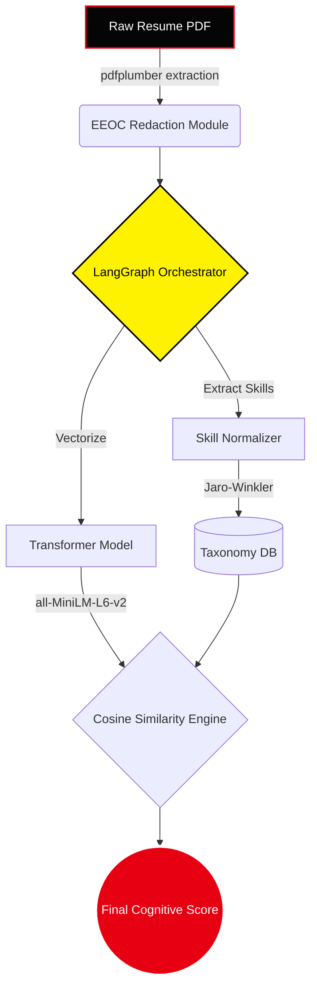

<div align="center">

# 🎭 PSI Resume Analyser: Cognitive ATS Masterclass

<a href="https://psi-resume-analyser.onrender.com">
  
</a>
<a href="https://huggingface.co/spaces/">
  
</a>
<a href="https://render.com">
  
</a>

<br/>

*Infiltrate the ATS algorithm. Expose hidden alignments. Secure the job.*

<p align="center">
  
</p>

</div>

---

## ⚡ Overview

The **PSI Resume Analyser** is an enterprise-grade, Multi-Agent pipeline built to ruthlessly audit resumes against target Job Descriptions. Using advanced **Semantic Cosine Similarity** and **LangGraph Orchestration**, it strips away the bias of traditional recruiter tools and evaluates your background based on pure, unadulterated technical merit.

Featuring a completely bespoke, heavily animated **Persona 5 Masterclass UI**, the application is designed to be as visually mesmerizing as its backend is powerful.

---

## 🧬 Architectural Branches

This repository is split into three distinct operational branches to support multiple deployment architectures:

| Branch Name | Primary Function | Deployment Environment |
|-------------|------------------|------------------------|
| 🟢 **`webapp`** | **The Main Masterclass UI.** Contains the full React Frontend (Grid UI, P5 Stickers) and the FastAPI Backend. | **Frontend**: Vercel <br/> **Backend**: Render |
| 🟠 **`huggingface`** | **The Rapid Gradio Deck.** Contains the `app.py` UI tailored for HuggingFace Spaces using Gradio components. | **HuggingFace Spaces** |
| 🔵 **`main`** | **The Root Legacy Pipeline.** Contains the foundational agents and core orchestration logic. | Local CLI / SDK |

---

## 🚀 Key Operations (Features)

### 1️⃣ Algorithmic Infiltration (ATS Matcher)
Upload a PDF resume and compare it against our preloaded tech job descriptions. The pipeline uses **text-embedding-004** to calculate deep semantic distance, successfully bypassing the rigid exact-match defenses of primitive recruiter software.

### 2️⃣ Blind Justice Protocol (EEOC Anonymizer)
Before any LLM evaluation takes place, the `pdfplumber` ingestion layer aggressively redacts demographic data (Names, Pronouns, Graduation Years) to ensure a 100% blind, unbiased audit.

### 3️⃣ STAR Bullet Optimizer
Paste weak resume bullet points to trigger the Writer Agent. It detects missing impact metrics and rewrites statements strictly following the **Situation, Task, Action, Result (STAR)** geometry while injecting high-weight semantic keywords.

### 4️⃣ Tinder-Style Job Swipe Deck *(Coming Soon)*
A rapid-fire, high-speed interface integrating with live global job APIs (Remotive, Arbeitnow). Swipe right on optimal targets to automatically trigger application sequences.

---

## 🧠 System Architecture (LangGraph)



---

## ⚙️ Local Infiltration Setup

To run the full stack locally for development or testing:

### 1. Initialize the Backend (FastAPI)
```bash
git checkout webapp
python -m venv venv
source venv/bin/activate  # On Windows: venv\Scripts\activate
pip install -r requirements.txt
uvicorn api:app --reload --port 10000
```

### 2. Initialize the Frontend (React / Vite)
```bash
cd frontend
npm install
npm run dev
```

### 3. Environment Secrets
Duplicate `.env.example` to `.env` and arm it with your API keys:
- `GROQ_API_KEY` (Required for LLM Orchestration)
- `GEMINI_API_KEY` (Optional Fallback)
- `HF_TOKEN` (Optional for accelerated Inference)

---

<div align="center">
  <p><i>"We shall scan the target's resumes and expose their hidden cheat keywords."</i></p>
  <b>— The Phantom Thieves of ATS</b>
</div>
