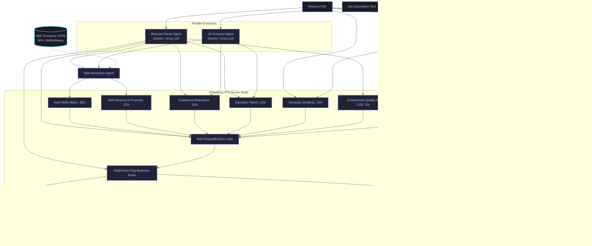

# PSI Resume Analyser 📄

An industrial-grade, multi-agent **ATS (Applicant Tracking System)** scoring, enhancement, and validation platform built with **LangGraph**, **Gradio**, and **Google Gemini / Groq**.

> **Note on Repositories**: The main master repository for development is the `master` branch of the GitHub repository. It contains the complete system codebase, testing suites, and configurations. It serves as the primary source of truth, from which builds are pushed and mirrored directly to HuggingFace Spaces (`huggingface/main`).

---

## 🗺️ System Architecture

PSI Resume Analyser utilizes a state-of-the-art **multi-agent workflow** orchestrated via a directed acyclic graph (DAG) using **LangGraph**. The workflow enforces strict validation boundaries and propagates extraction states through a structured schema.

### 📊 System Workflow


### 🔄 Node Orchestration Details
1. **Resume Parser Agent**: Extracts unstructured resume text into a standardized JSON schema containing contact details, professional experience bullet points, education history, certified credentials, and total experience metrics. It supports automatic fallback from Google Gemini to Groq (Llama 3.3 70B).
2. **Job Description Extractor Agent**: Summarizes the job description, mapping required skills, preferred skills, minimum experience years, education requirements, and core responsibilities into a structured representation.
3. **Skill Normalizer Agent**: Resolves raw variations of technical skills (e.g. "ReactJS", "React.js", "React JS") to a canonical skill taxonomy (e.g., "react") using a fast local taxonomy dictionary. Skills that cannot be mapped locally are passed as a batch to the LLM to find semantic equivalents.
4. **ATS Scorer Node**: Evaluates candidate fit across a 7-factor composite scoring engine, checks flags, and processes auto-disqualification business rules.
5. **Adversarial Auditor Node**: Conducts automated testing against hacking, and executes the EEOC bias audits.
6. **Resume Improver Agent**: Suggests targeted resume enhancements, identifies matching skills to add, and rewrites weak experience bullets to align with the A-COE (Action-Context-Outcome-Evidence) standard.

---

## ⚡ Key Features

### 🎯 Enterprise ATS Scoring (7-Factor Model)

The match score (0-100) is calculated via a rigorous composite formula:

1. **Hard Skills Match (35%)**: Calculates the Jaccard-like overlap percentage of the candidate's normalized skills against the required job description skills.
2. **Skill Recency & Proximity (15%)**: Evaluates when skills were last used. Skills mentioned in recent projects or work experience receive full weight, while skills that are stale (e.g. not mentioned in 5+ years) receive a penalty.
3. **Experience Relevance (20%)**: Nuanced numeric and context comparison between the candidate's years of experience and the job description requirements. Meets-or-exceeds years receive a baseline of 85 points with additional scaling up to 100.
4. **Education Match (10%)**: Compares the candidate's degree level (High School, Associate's, Bachelor's, Master's, PhD) against the required degree using a hierarchical mapping.
5. **Semantic Similarity (10%)**: Computes the dense cosine embedding similarity between the full resume and job description using the local `all-MiniLM-L6-v2` transformer model.
6. **Achievement Quality (5%)**: Scores experience bullets based on the presence of **A-COE factors** (Action, Context, Outcome, and quantitative Evidence).
7. **Buzzword Compliance (5%)**: Checks density of generic corporate buzzwords (e.g., "synergy", "paradigm shift", "results-oriented") and applies negative scoring scaling.

$$\text{Base Score} = 0.35 \times \text{Hard Skills} + 0.15 \times \text{Skill Recency} + 0.20 \times \text{Experience Relevance} + 0.10 \times \text{Education Match} + 0.10 \times \text{Semantic Similarity} + 0.05 \times \text{Achievement Quality} + 0.05 \times \text{Buzzword Compliance}$$

$$\text{Final Match Score} = \min\left(100.0, \max\left(0.0, \text{Base Score} + \sum \text{Green Flag Bonuses} - \sum \text{Red Flag Penalties}\right)\right)$$

---

### 🚨 Compliance & Risk Engine (Red & Green Flags)

#### Red Flag Penalties:
- **AI-Resume Detection**: Auto-disqualifies resumes with formatting structure indicating high LLM generation probability (≥ 85%).
- **Timeline Gaps**: Deducts **-15.0 points** if unexplained timeline gaps exceed 12 months.
- **Job Hopping**: Deducts **-10.0 points** for 3 or more short-term tenures (under 12 months) in recent history.
- **Fabrication Risk**: Deducts **-8.0 points** if less than 50% of listed skills are backed by corresponding descriptions in the experience history.
- **Buzzword Overload**: Deducts **-5.0 points** for high buzzword density.
- **Vague Achievements**: Deducts **-5.0 points** if bullet points average low A-COE scores.

#### Green Flag Bonuses:
- **COE Formatted Bullets**: Adds **+5.0 points** if bullet points are structured with clear metrics and outcomes.
- **Skill-JD Mirroring**: Adds **+4.0 points** if critical skills map cleanly.
- **Upward Trajectory**: Adds **+3.0 points** if experience shows progressive growth in title and responsibilities.
- **Portfolio Accessible**: Adds **+2.0 points** for active GitHub, LinkedIn, or personal website links.
- **Rehired by Same Employer**: Adds **+2.0 points** for returning to a previous company.

---

### ⭐ Premium Paid Tier (MNC Grade Verification)

 PSI Resume Analyser includes a premium verified auditing tier ($49/audit simulated via an interactive checkout sandbox in the Enterprise Portal):

1. **Invisible White-Text Scan (ATS Gaming Safeguard)**: Inspects the PDF character-level metadata color values using `pdfplumber` to extract `non_stroking_color` values. If hidden white keywords (RGB `[1, 1, 1]`) stuffed in background templates are detected, the system flags the resume with a **-25.0 points** penalty.
2. **Candidate Link Verification & Trust Scorer**: Extracts LinkedIn, GitHub, and portfolio URLs from the resume text. It runs network pings to verify URL responsiveness (handling scraper blocks like HTTP 403/999) and scrapes public GitHub metadata to calculate a **Candidate Trustability Index (0-100)**.

---

### 🔄 MLOps Fine-Tuning Data Loop

To support continuous model improvements, successful pipeline execution runs automatically feed back into our data accumulation pipeline:
- **Logging Engine**: Appends raw resume text, job description requirements, parsed output JSON payloads, and match score metrics to a local `data/finetuning_dataset.jsonl` file.
- **Instruction-Fine-Tuning Format**: Structured as `{"instruction": "...", "input": "...", "output": "..."}` ready to train custom models.
- **Monitoring**: Live dataset statistics (number of collected records) are visible on the LLMOps Observability Dashboard.

---

### 🛡️ GAN Adversarial Stress-Tester
Simulates a **Generative Adversarial Network (GAN)** design inside Tab 4:
- **Generator (LLM)**: Crafts a "hacked" resume section stuffed with keywords, buzzwords, and fabricated experience specifically optimized to trick ATS search parameters.
- **Discriminator (ATS Scorer)**: Intercepts the hacked resume, runs it through the compliance rules, checks for fabrication risk/AI probability, and prints mitigation logs explaining which flags intercepted the exploit.

---

### ⚖️ EEOC Demographic Fairness Audit
To verify that the scoring pipeline is unbiased, the platform performs a **genuine counterfactual identity injection audit**:
1. **Identity Injections**: Creates 5 variants of the raw resume text, changing only names, pronouns, and honorifics across different demographic groups (Male, Female, Non-Binary, culturally diverse).
2. **Multi-Agent Pipeline Execution**: The parser, normalizer, and scorer are re-run independently on each variant. If the extraction or scoring is biased based on names or pronouns, the scores will diverge.
3. **EEOC Compliance Threshold**: Computes statistical variance. EEOC compliance is passed if:
   - The score standard deviation ($\sigma$) is $< 2.0$.
   - The absolute deviation from the mean for any single profile is $< 3.0$ points.
4. **API Quota Resilience**: The audit loop has built-in fallbacks. If any sub-call hits API rate limits (HTTP 429), the audit pauses and returns a friendly error warning card, rather than throwing a system traceback.

---

## 🚀 Installation & Local Development

### 1. Requirements
Ensure you have **Python 3.12+** installed on your system.

### 2. Setup Codebase
```bash
# Clone the master repository
git clone https://github.com/namangt/PSI_resume_analyser.git
cd PSI_resume_analyser

# Create a virtual environment
python -m venv .venv
source .venv/bin/activate  # On Windows: .venv\Scripts\activate

# Install dependencies
pip install -r requirements.txt
```

### 3. Environment Variables
Create a `.env` file in the root of the project:
```env
GROQ_API_KEY=your_groq_api_key_here
GOOGLE_API_KEY=your_gemini_api_key_here
```

### 4. Run the Gradio App
```bash
python app.py
```
Open `http://127.0.0.1:7860` in your browser.

### 5. Running Tests
```bash
python -m pytest
```

---

## 📦 Deployment to HuggingFace Spaces

To deploy changes directly to HuggingFace:
```bash
# Add HuggingFace remote
git remote add hf https://huggingface.co/spaces/namangt/PSI_resume_analyser

# Push the master branch to HF main
git push hf master:main
```

---

## 🛠️ Tech Stack Details

- **Orchestration**: LangGraph, LangChain Core
- **LLM Engine**: Google Gemini 2.0 Flash / Groq Llama 3.3 70B
- **Embeddings**: HuggingFace SentenceTransformers (`all-MiniLM-L6-v2`)
- **PDF Parsers**: pdfplumber & PyPDF2
- **Interface**: Gradio 5.33.0 (Responsive, styled with modern Glassmorphic theme)
- **Formatting**: FPDF2 (for resume builder export)

---

## 📄 License
This project is licensed under the MIT License.
