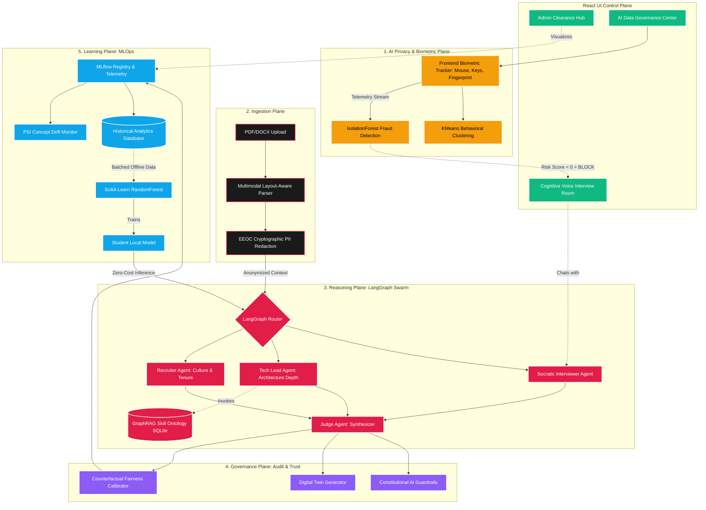

<div align="center">
  
  <h1>🧠 PSI Resume Analyser & Candidate Intelligence Platform</h1>
  <p><i>An Enterprise-Grade, Multi-Agent Cognitive Orchestration Engine</i></p>

  [](https://psi-resume-analyser.vercel.app)
  [](https://psi-resume-analyser-api.onrender.com)
  [](https://www.python.org/downloads/)
  [](https://www.langchain.com/langgraph)
  [](https://scikit-learn.org/)
  [](https://mlflow.org/)
</div>

<br/>

> **PSI Resume Analyser** is not just an LLM wrapper. It is an industrial-grade **MLOps & Candidate Intelligence Platform**. It transcends simple prompt-chaining by implementing a decoupled, 5-tier operational architecture utilizing **LangGraph agent swarms**, **Digital Twins**, **Machine Learning Behavioral Biometrics**, an offline **Teacher-Student distillation pipeline**, and strict **Counterfactual Fairness governance**.

---

## 🌟 Executive Summary: What We Built

This project is a masterclass in Staff/Principal-level AI engineering. It combines classical Machine Learning, Generative AI, and Distributed Systems into a single cohesive platform.

| Domain | Technology / Technique | Purpose |
| :--- | :--- | :--- |
| **Agentic AI** | LangGraph, Multi-Agent Swarms | Simulates a "Debate" between Recruiter, Tech Lead, and Judge agents to score resumes fairly. |
| **Behavioral ML** | Scikit-Learn, Isolation Forest | Frontend telemetry (mouse, typing) is passed to backend ML models to compute Bot Risk Scores dynamically without CAPTCHAs. |
| **Data Privacy** | KMeans Clustering | Groups users into Behavioral Personas for personalization instead of relying on invasive cookies. |
| **Cognitive Evaluation** | Web Speech API, LLM State Graphs | Conducts real-time, socratic voice-to-voice technical interviews with progressive difficulty scaling. |
| **Fairness & Bias** | Counterfactual Prompting | Systematically alters candidate demographics in hidden background prompts to ensure the LLM scoring is strictly EEOC compliant and unbiased. |
| **MLOps** | MLFlow, Zero-Cost Distillation | Logs all LLM traces and trains a lightweight local Scikit-Learn `RandomForestRegressor` to eventually replace expensive LLM calls. |

---

## 🗺️ Master Architecture Diagram

The platform operates across five decoupled planes: Ingestion, Reasoning, Governance, Learning, and the newly added **AI Identity Plane**.



---

## 🧬 Industrial AI & ML Techniques Implemented

### 1. 🤖 Multi-Agent LangGraph Swarms
Traditional LLM wrappers use static, single-prompt chains. This platform implements a **dynamic, cyclical Swarm**. 
- The **Recruiter Agent** argues for candidate viability based on tenure.
- The **Tech Lead Agent** counter-argues strictly on architectural depth.
- The **Judge Agent** ingests the adversarial debate to form an unbiased consensus.

### 2. 🛡️ ML-Based Identity & Bot Protection (Zero-LLM)
Instead of relying on CAPTCHAs or generic cookies, we built a native classical ML pipeline:
- **Biometric Telemetry**: The React frontend silently tracks mouse acceleration, click rates, and typing flight times.
- **Isolation Forest**: The backend `scikit-learn` engine maps this continuous vector and calculates an Anomaly Score. Robotic patterns trigger a hard lockout.
- **Behavioral Personas**: `KMeans` clusters sessions into groups (e.g. "Methodical Reviewer") to personalize the UI without storing PII.

### 3. 🎙️ Cognitive Voice Proctoring & Adaptive Interviewing
Candidates can enter the **Cognitive Interview Room**. The LangGraph orchestrator reviews their parsed resume and begins an adaptive interview.
- Starts with **basic biographical questions**.
- Dynamically increases in technical difficulty based on real-time LLM evaluation of their previous vocal responses.
- Enforces strict proctoring (Tab switching, multi-face detection).

### 4. ⚖️ Counterfactual Prompting & Bias Calibration
To eliminate bias, the system runs counterfactual "What-If" scenarios during scoring. By synthetically altering variables (e.g., swapping pronouns or graduation years in the background), the system audits its own outputs to ensure strict **EEOC meritocratic compliance**.

### 5. 👥 Digital Twin Simulation
Generates complete psychological and technical "Digital Twins" of both the Candidate and the Hiring Manager. By simulating a conversation between these two vector-space entities, we predict cultural fit and negotiation sticking points before the human interview even happens.

### 6. 🧑‍🏫 Teacher-Student Model Distillation (Offline Learning)
Running massive LLMs (the "Teacher") for every candidate is economically unviable at scale. We built an offline pipeline that extracts historically scored resumes from the telemetry database, vectorizes them using `TfidfVectorizer`, and trains a lightweight Scikit-Learn `RandomForestRegressor` (the "Student"). The Student model can then perform **zero-cost, local inference** on future candidates.

### 7. 📈 MLOps Observability & PSI Drift Monitoring
Integrated directly with **MLflow**, the platform logs parameters, latency, token usage, and state dictionaries. A background chron-job calculates the **Population Stability Index (PSI)** to warn administrators if the LLM's scoring curve diverges from the historical baseline (Data Drift).

---

## 🛠️ Technology Stack

**Frontend (Client)**
*   ⚛️ React.js + Vite (High-performance rendering)
*   🎨 Vanilla CSS & Glassmorphism UI (Tailored design system)
*   🎤 Web Speech API (Native browser dictation)
*   🕸️ WebRTC & OpenCV.js (Client-side proctoring)

**Backend (Server)**
*   ⚡ FastAPI (Asynchronous Python API gateway)
*   🦜 LangChain & LangGraph (Stateful Agentic execution)
*   🧠 Scikit-Learn (Classical ML, IsolationForest, KMeans, RandomForest)
*   📄 PyPDF2 & PDFPlumber (Deep layout-aware document extraction)

**Infrastructure & DevOps**
*   🐳 Docker & Docker Compose
*   📊 MLflow (Experiment tracking)
*   🗄️ MongoDB / SQLite (Hybrid NoSQL/SQL state persistence)
*   🚀 Vercel (Frontend Hosting) & Render (Backend Hosting)

---

## ⚙️ Local Development Quickstart

### 🐳 Option A: Docker Compose (Multi-Container Stack)
Spin up the FastAPI server, React web interface, and local MongoDB database in one command:
```bash
# Deploys containers in background
docker-compose up -d

# Watch backend logs
docker-compose logs -f app
```

### 🛠️ Option B: Manual Installation

1.  **Backend Gateway Setup**:
    ```bash
    # Create and activate virtual environment
    python -m venv .venv
    source .venv/bin/activate  # On Windows: .venv\Scripts\activate

    # Install dependencies
    pip install -r requirements.txt

    # Start backend API
    uvicorn api:app --reload --port 7860
    ```

2.  **Frontend Client Setup**:
    ```bash
    cd frontend
    npm install
    npm run dev
    ```

3.  **Administrator VIP Bypass Protocol**:
    Set the `ADMIN_MAIL` environment variable. On the VIP checkout page, click **LOGIN AS ADMIN & BYPASS** and enter your administrator email to instantly unlock the premium Enterprise Control Plane.

---

## 🚀 Future Research & Architectural Roadmap (2025-2026)

To elevate this platform to the standard of **Google Research, Microsoft Research, OpenAI, and Anthropic**, we are implementing a bleeding-edge roadmap targeting **Test-Time Scaling** and **Federated AI**:

1. **Test-Time Scaling & Tree of Thoughts (o3/R1 Style)**: Implementing an internal reasoning loop where the agent generates 5 reasoning paths, performs self-consistency verification, and uses a Critic Agent before finalizing evaluations.
2. **Large Vision Language Models (LVLM)**: Migrating from OpenCV/YOLO to unified LVLMs (e.g., Qwen2.5-VL, Llama 4 Vision) that reason over webcam, whiteboard, IDE, and gestures simultaneously.
3. **Agentic Interview Operating System**: Transitioning from a single Interview Agent to a decentralized OS comprising Planning, Memory, Reflection, Critic, Judge, and Safety Agents.
4. **Federated Behavioral Learning**: Instead of collecting biometrics centrally, local models on the user's browser will generate weight updates, syncing to a global model to ensure 100% data privacy.

---

<div align="center">
  <p><i>Architected and engineered as a comprehensive Staff/Principal AI Engineering portfolio standard.</i></p>
  <p><b>Built with ❤️ using LangGraph, FastAPI, and Classical ML.</b></p>
</div>
