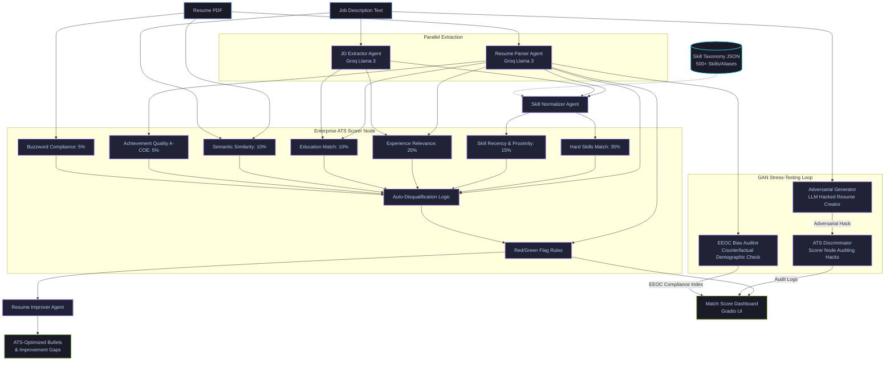

# PSI Resume Analyser 📄

An industrial-grade multi-agent **ATS (Applicant Tracking System)** scoring and optimization pipeline built with **LangGraph**, **Gradio**, and **Groq (Llama 3)**.

---

## 🗺️ System Architecture

### 📊 Visual Workflow


### 🔄 Data Flow Detail (LangGraph Structure)



---

## ⚡ Key Optimizations

- **Combined LLM Normalization**: Consolidates both resume and JD unresolved skill normalization into a single concurrent LLM call, reducing pipeline latency and saving 50% on API limits.
- **Concurrent Startup Loader**: Pre-loads the local SentenceTransformer model in a background thread at app launch, ensuring zero wait times for the first analysis request.
- **Deterministic Experience Matcher**: Uses a local, rule-based experience scoring engine to calculate matching scores in microseconds instead of relying on expensive external LLM API calls.
- **Robust Exception Handling**: Prevents pipeline crashes by safeguarding all list and dictionary lookups against potential null values returned from parsed inputs.

---

## 🛠️ Tech Stack

| Component | Technology |
|-----------|------------|
| **Orchestration** | LangGraph + LangChain |
| **Primary LLM** | Groq (Llama 3.3 70B - Versatile) |
| **Embeddings** | all-MiniLM-L6-v2 |
| **PDF Parsing** | PyPDF2 + pdfplumber |
| **Frontend UI** | Gradio (5.33.0) |
| **Deployment** | HuggingFace Spaces |

---

## 🚀 Quick Start

### 1. Installation
```bash
# Clone the repository
git clone https://huggingface.co/spaces/namangt/PSI_resume_analyser
cd PSI_resume_analyser

# Install dependencies
pip install -r requirements.txt
```

### 2. Configure Environment
Create a `.env` file in the root directory:
```env
GROQ_API_KEY=your_groq_api_key_here
```

### 3. Run Locally
```bash
python app.py
```

---

## 📊 Scoring Formula

The matching engine employs an enterprise-grade Applicant Tracking System (ATS) calculation combining weighted scoring with business rule penalties and bonuses:

$$\text{Base Score} = 0.35 \times \text{Hard Skills} + 0.15 \times \text{Skill Recency} + 0.20 \times \text{Experience Relevance} + 0.10 \times \text{Education Match} + 0.10 \times \text{Semantic Similarity} + 0.05 \times \text{Achievement Quality} + 0.05 \times \text{Buzzword Compliance}$$

$$\text{Final Match Score} = \min\left(100.0, \max\left(0.0, \text{Base Score} + \sum \text{Green Flag Bonuses} - \sum \text{Red Flag Penalties}\right)\right)$$

### 🚨 Disqualification & Business Rules:
- **AI-Resume Detection**: Template matches with $\ge 85\%$ probability triggers **AUTO-DISQUALIFICATION**.
- **Timeline Gaps**: Unexplained career gaps $>12$ months penalize **-15.0 pts**.
- **Job Hopping**: $3+$ consecutive tenures $<12$ months without contract/intern labels penalize **-10.0 pts**.
- **Fabrication Detection**: $<50\%$ of listed skills supported by projects or work context penalize **-8.0 pts**.
- **Buzzword Overload**: Excessive corporate buzzwords without quantifiable metrics penalize **-5.0 pts**.
- **Green Flag Bonuses**: Quantitative achievements (A-COE), target-title alignment, skill mirroring, and online portfolios award up to **+17.0 pts** of bonuses.

---

## 📄 License
MIT License
